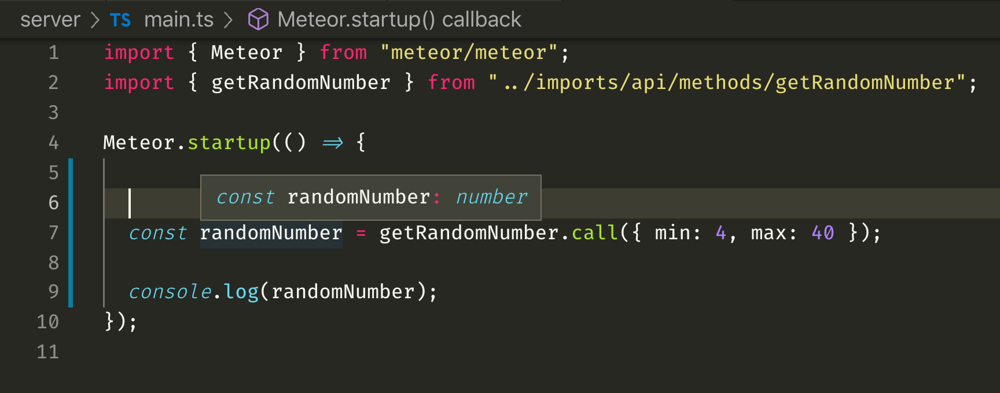

ValidatedMethod package is the default wrapper around creating meteor methods.

// link to the repo here

# The setup

I've created a new meteor project using:

`meteor create --release 1.8.2-rc.0 --typescript typed-meteor-methods`

Specific release version is used to have access to the `--typescript` option.

Install ValidatedMethod package:
`meteor add mdg:validated-method`

Add file `/imports/api/methods/getRandomNumber.js`:

```javascript
import { ValidatedMethod } from "meteor/mdg:validated-method";

const getRandomNumber = new ValidatedMethod({
  name: "global.getRandomNumber",
  validate: () => {},
  run({ min, max }) {
    return Math.round(Math.random() * (max - min) + min);
  }
});
```

We could use SimpleSchema for the `validate` method but the focus should not be on that.

Import the method in `/server/main.ts`

```javascript
import "../imports/api/methods/getRandomNumber";
```

Change `App.tsx` contents:

```javascript
import React from "react";
import { Meteor } from "meteor/meteor";

export default class App extends React.Component {
  state = {
    randomNumber: null
  };

  componentWillMount() {
    Meteor.call(
      "global.getRandomNumber",
      { min: 5, max: 20 },
      (error: Meteor.Error, data: number) => {
        if (data) {
          this.setState({ randomNumber: data });
        }
      }
    );
  }

  render() {
    return (
      <div>
        Random number:
        {this.state.randomNumber === null ? "N/A" : this.state.randomNumber}
      </div>
    );
  }
}
```


```javascript
import { Meteor } from "meteor/meteor";
import { getRandomNumber } from "../imports/api/methods/getRandomNumber";

Meteor.startup(() => {
  console.log(getRandomNumber.call({ min: 4, max: 40 }));
});
```


# Typing the `call` method
Before trying to figure out a way to type the `Meteor.call`, let's start simple, by typing the `getRandomNumber.call()` in `/server/main.ts`.

I found the initial typings here:
https://github.com/meteor-typings/validated-method/blob/master/main.d.ts
They were created by Dave Allen.

The worked good enough, but it is possible to make them generic, so let's try that.

Since the type definitions are local we have more leeway in what we can do with them. Below is a modified version of the one linked above.

```typescript
declare module "meteor/mdg:validated-method" {
  import { DDPCommon } from "meteor/ddp";
  import { Meteor } from "meteor/meteor";

  type ValidatedMethodOptions<TRunArg, TRunReturn> = {
    name: string;
    mixins?: Function[];

    validate: ((args: TRunArg) => void) | null;

    applyOptions?: {
      noRetry: boolean;
      returnStubValue: boolean;
      throwStubExceptions: boolean;
      onResultReceived: (result: any) => void;
      [key: string]: any;
    };
    run: (this: DDPCommon.MethodInvocation, arg: TRunArg) => TRunReturn;
  };

  export class ValidatedMethod<TRunArg, TRunReturn> {
    constructor(options: ValidatedMethodOptions<TRunArg, TRunReturn>);

    call(args: TRunArg): TRunReturn;
    call(
      args: TRunArg,
      callback: (error: Meteor.Error, result: TRunReturn) => void
    ): void;

    _execute(context: { [key: string]: any }, args: TRunArg): void;
  }
}
```

`Meteor.call` methods can be passed multiple arguments but with `ValidatedMethod`, the standard is passing a single object with multiple properties. This makes it much easier to type since we have a type variable for teh input argument (`TRunArg`) and one for the return argument (`TReturn`).
Notice that `ValidatedMethod` can also be passed mixins in the constructor and those should be also typed, but they are beyond the scope of this article.

Typescript now knows how the method can be called directly and shows some suggestions:


Before we move forward let's add a small wrapper over the `Meteor.call`.

## The `callAsync` wrapper
As per the documentation, `Meteor.call` should receive a string as the first argument, followed by some parameters to pass to the method, and at the end a callback can also be passed.
Instead of trying to work around this limitation a simple promise wrapper can be created:

```typescript
import { Meteor } from "meteor/meteor";

const callAsync = (methodName: string, arg: any) =>
  new Promise<any>((resolve, reject) =>
    Meteor.call(methodName, arg, (error: Meteor.Error, result: any) => {
      if (error) {
        reject(error);
      } else {
        resolve(result);
      }
    })
  );

export default callAsync;
```

This was introduced by one of my colleagues @barbaros and we found it to be very useful.
Instead of calling the `Meteor.call` in `App.tsx` and passing a callback, a promise can be used:

```typescript
// Old way
Meteor.call(
  "global.getRandomNumber",
  { min: 5, max: 20 },
  (error: Meteor.Error, data: number) => {
    if (data) {
      this.setState({ randomNumber: data });
    }
  }
);

// New way
callAsync("global.getRandomNumber", { min: 5, max: 20 })
  .then(randomNumber => {
    this.setState({ randomNumber });
  })
  .catch(() => {})
```

This level of strong typing might prove enough for most people, and it did for us for some time. But, wouldn't it be nice for `callAsync` to know what method names were declared and what types can be passed and received.

# Typing APIs
In many aspects, meteor methods are similar to REST API calls. Since I didn't expect there to be many attempts at typing meteor methods, since meteor wasn't thought with Typescript in mind, I started to search for approaches of typing REST APIs using typescript.

Most of the articles and github repositories I've found relied on the existence of a global interface that contained all the data about the name, arguments and return values of all the REST endpoints.

This would be the smart approach forcing to catalogue all the methods by hand and afterwards keep them method api interface and the implementation in sync seemed like too much of a hastle. A better approach would be to leave the implementation as they are and extract the needed types for further use.

## Typing the name of the function

Now comes the cool part. The `ValidatedMethods` type definition has to be augmented so that it knows the name of the function as a string literal as opposed to a string.
Compared to most other typed languages, Typescript has the concept of string literals, which allows to, for example type semaphores colors like so:

```typescript
const semaphore: 'yellow' | 'red' | 'green' = 'green';
```

An additional generic type variable seems to do the trick:

```typescript
type ValidatedMethodOptions<TRunArg, TRunReturn, TName extends string> = {
  // Force the name to be a string literal
  name: TName;
  mixins?: Function[];

  validate: ((args: TRunArg) => void) | null; // returned from SimpleSchemaInstance.validator() method;
  applyOptions?: {
    noRetry: boolean;
    returnStubValue: boolean;
    throwStubExceptions: boolean;
    onResultReceived: (result: any) => void;
    [key: string]: any;
  };
  run: (this: DDPCommon.MethodInvocation, arg: TRunArg) => TRunReturn;
};

export class ValidatedMethod<TRunArg, TRunReturn, TName extends string> {
  constructor(options: ValidatedMethodOptions<TRunArg, TRunReturn, TName>);

  call(args: TRunArg): TRunReturn;
  call(args: TRunArg, callback: (error: Meteor.Error, result: TRunReturn) => void): void;

  _execute(context: { [key: string]: any }, args: TRunArg): void;
}
```

Typescript correctly infers the type of name as a string literal instead of a string:

The only thing that has to be typed is the argument to the run function, and maybe its return type if it has to be enforced.


### Notes on the TName
When I started writing this article I mistakenly assumed that Typescript is inferring the type of name as a simple string. To overcome this problem I had to do some tricks to enforce it.

We were using the following code:

```typescript
export type UnionToIntersection<U> = (U extends any ? (k: U) => void : never) extends ((k: infer I) => void)
  ? I
  : never;
export type CheckForUnion<T, TErr, TOk> = [T] extends [UnionToIntersection<T>] ? TOk : TErr;
```

and then type the `name` as follow:

```typescript
type ValidatedMethodOptions<TRunArg, TRunReturn, TName extends string> = {
// Force the name to be a string literal
name: TName & CheckForUnion<TName, never, {}>;;

...
} 
```

You can read more in [this StackOverflow answer](https://stackoverflow.com/a/56375136/2659549)


# Creating a unified API
Even though each specific method is fully typed, we somehow need to gather all the instances and create a unified type so that `callAsync` knows what's going on.

